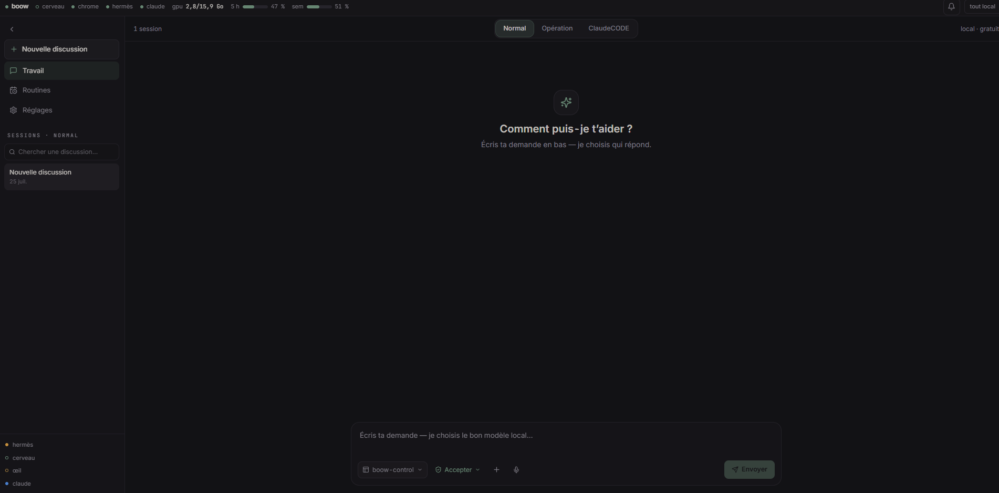
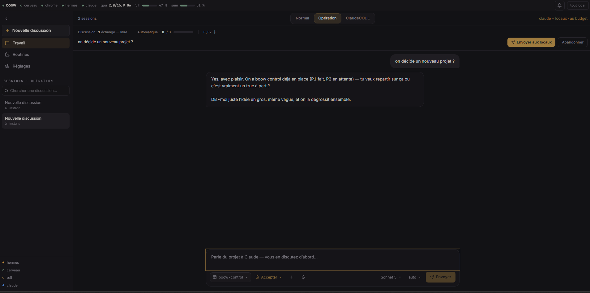
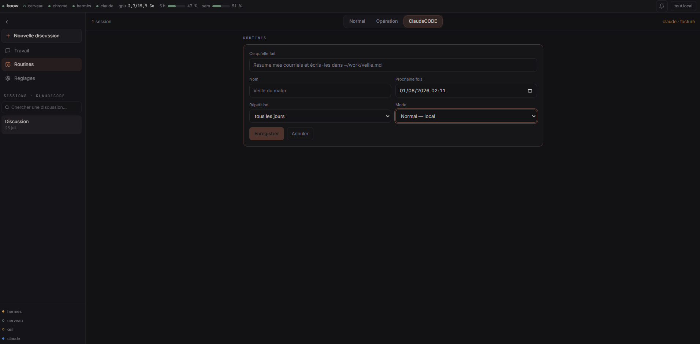
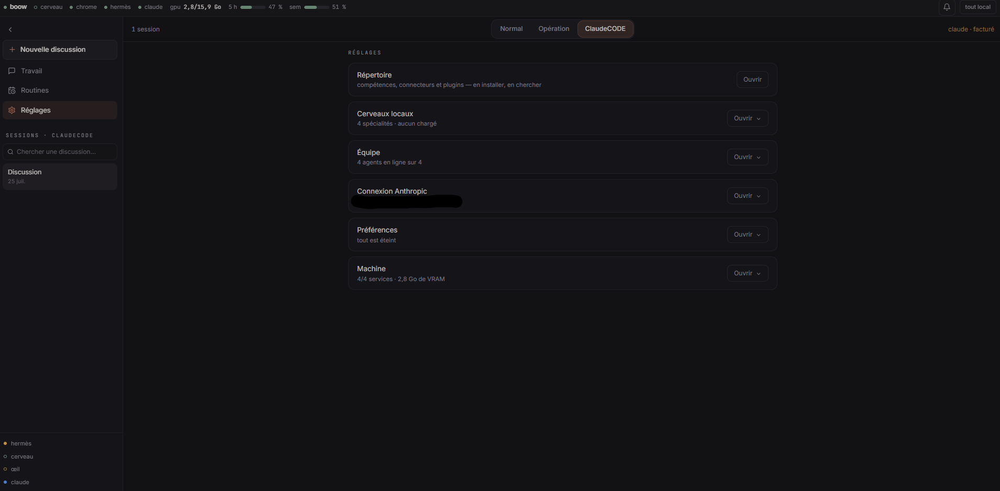
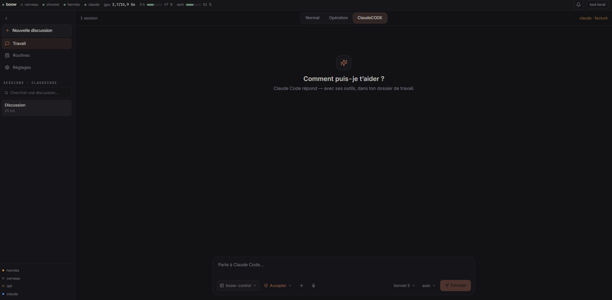
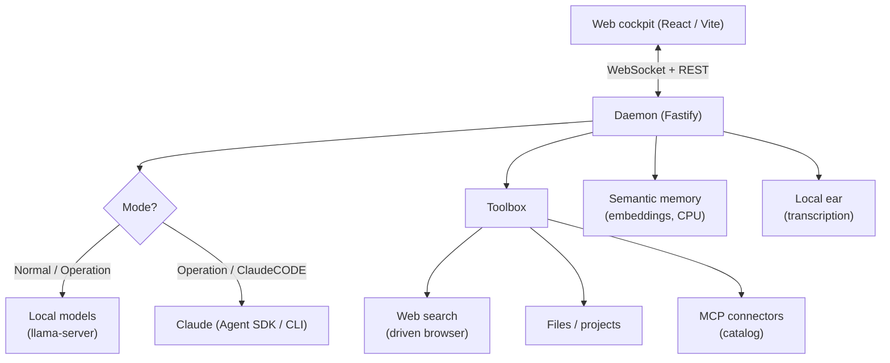

<div align="center">

# boow-control

**A local cockpit that orchestrates AI agents — yours run on your machine, Claude steps in only when it's worth it.**
*Un cockpit local qui orchestre des agents IA — les tiens tournent chez toi, Claude n'intervient que quand ça vaut le coup.*




</div>

---

## Overview · Aperçu

| | |
|---|---|
|  | **Operation mode** — Claude drafts the plan, local models execute.<br/>*Mode Opération — Claude fait le plan, les locaux exécutent.* |
|  | **Routines** — scheduled jobs (e.g. « summarize my mail each morning »).<br/>*Routines — tâches programmées.* |
|  | **Settings** — brains, team, connectors, machine.<br/>*Réglages — cerveaux, équipe, connecteurs, machine.* |
|  | **ClaudeCODE mode** — full Claude Code, in the cockpit.<br/>*Mode ClaudeCODE — Claude Code complet.* |

---

## 🇬🇧 English

### What it is

**boow-control** is a self-hosted control panel for AI agents. You type in a
single box; the system decides *who* answers — your **local models** (free,
private) or **Claude** for the delicate work — without ever asking you to pick a
model. You pick a **mode**, not a model.

The whole thing is built to run on your own machine and to keep your data there
by default.

### The three modes

| Mode | Who works | For what |
|---|---|---|
| **Normal** | 100% your local models | everyday work, free, private |
| **Operation** | Claude plans → local models execute | build a project while capping Claude calls |
| **ClaudeCODE** | full Claude Code | the heavy, delicate tasks |

Routing is **invisible**: you write, the daemon picks the right brain (code /
generalist / vision) and the right mode.

### Architecture



### The stack

- **pnpm monorepo** — `apps/daemon` (Fastify / TypeScript), `apps/web`
  (React 19 / Vite / Tailwind), `packages/shared` (shared types).
- **Local models** served by a `llama-server` in router mode (one model in VRAM
  at a time, loaded on demand): a *code* model, a *generalist* (+ reasoning), a
  *vision* model, a *fast* one, and *embeddings* on CPU.
- **MCP toolbox** — local brains get *hands*: native tools (web search, files,
  project search) **and** a curated **catalog of MCP connectors** (GitHub,
  Postgres, Notion, Slack, Figma, Playwright…), tagged **① no-key · ② paste-a-token
  · ③ Claude (OAuth)**. For OAuth-only services, the catalog offers a **token
  path** so local models can use them too.
- **Semantic memory** — your projects indexed (quantized embeddings), searchable
  *by meaning*.
- **Local ear** — dictation transcribed on the machine, nothing sent to a third
  party.
- **Long sessions** — a context gauge + **automatic compaction** (a rolling
  summary produced by the local model) for near-unlimited local conversations.
- **Acceptance net** — `pnpm recette` drives a real browser to check the whole
  thing before anything ships.

### Getting started

```bash
pnpm install
cp .env.example .env   # everything is optional
pnpm dev               # daemon (:8788) + web (:5180)
```

**Prerequisites:** Node 24 + pnpm, a `llama-server` (llama.cpp) exposing an
OpenAI-compatible endpoint with your GGUF models (not included); optionally the
Claude Code CLI and a debug Chrome for web search. All settings are optional and
documented in [`.env.example`](.env.example). Runtime data (installed connectors,
search index, secrets) lives **outside** the repo (`~/.boow`, `~/.hermes`) and is
never versioned.

> This public repo does **not** include model weights (`.gguf`), decorative 3D
> assets, or any personal data — the app starts fine without them.

---

## 🇫🇷 Français

### Ce que c'est

**boow-control** est un tableau de bord auto-hébergé pour agents IA. Vous écrivez
dans une seule barre ; le système choisit *qui* répond — vos **modèles locaux**
(gratuits, privés) ou **Claude** pour le délicat — sans jamais vous demander de
choisir un modèle. On choisit un **mode**, pas un modèle.

L'ensemble est pensé pour tourner sur votre machine et y garder vos données par
défaut.

### Les trois modes

| Mode | Qui travaille | Pour quoi |
|---|---|---|
| **Normal** | 100 % vos modèles locaux | le quotidien, gratuit, privé |
| **Opération** | Claude planifie → les locaux exécutent | construire un projet en bornant les appels à Claude |
| **ClaudeCODE** | Claude Code complet | le costaud, le délicat |

Le routage est **invisible** : vous écrivez, le daemon choisit le bon cerveau
(code / généraliste / vision) et le bon mode.

### La stack

- **Monorepo pnpm** — `apps/daemon` (Fastify / TypeScript), `apps/web`
  (React 19 / Vite / Tailwind), `packages/shared`.
- **Modèles locaux** servis par un `llama-server` en mode routeur (un modèle en
  VRAM à la fois) : *code*, *généraliste* (+ raisonnement), *vision*, *rapide*,
  et *embeddings* sur CPU.
- **Boîte à outils MCP** — les cerveaux locaux ont des *mains* : outils natifs
  (recherche web, fichiers, recherche projets) **et** un **catalogue de
  connecteurs MCP** (GitHub, Postgres, Notion, Slack, Figma, Playwright…),
  étiquetés **① sans clé · ② jeton à coller · ③ Claude (OAuth)**. Pour les OAuth,
  le catalogue propose une **voie « jeton »** utilisable par les locaux.
- **Mémoire de recherche** — vos projets indexés, interrogeables *par le sens*.
- **Oreille locale** — dictée transcrite sur la machine, rien n'est envoyé
  dehors.
- **Sessions longues** — jauge de contexte + **compaction automatique** (résumé
  glissant par le modèle local) pour des conversations locales quasi illimitées.
- **Filet de recette** — `pnpm recette` pilote un vrai navigateur pour tout
  vérifier avant publication.

### Démarrage

```bash
pnpm install
cp .env.example .env   # tout est optionnel
pnpm dev               # daemon (:8788) + web (:5180)
```

**Prérequis :** Node 24 + pnpm, un `llama-server` (llama.cpp) exposant un
endpoint OpenAI-compatible avec vos modèles GGUF (non fournis) ; en option le CLI
Claude Code et un Chrome en mode debug pour la recherche web. Tout est optionnel
et documenté dans [`.env.example`](.env.example). Les données de fonctionnement
(connecteurs, index, secrets) vivent **hors du dépôt** (`~/.boow`, `~/.hermes`).

> Ce dépôt public **n'inclut pas** : les poids de modèles (`.gguf`), les
> ressources 3D décoratives, ni aucune donnée personnelle.

---

<div align="center">

*Architecture & design by the author. Code written with the help of AI coding
assistants, under the author's direction.*
<br/>
*Architecture et conception par l'auteur. Code écrit avec l'aide d'assistants de
code IA, sous sa direction.*

</div>
