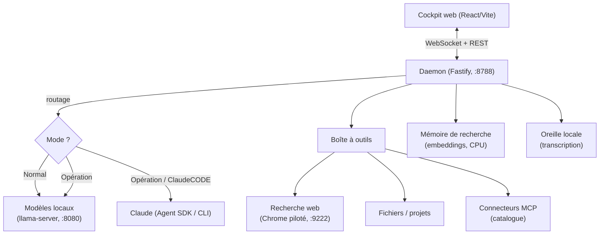

# boow-control

**Un cockpit local d'orchestration d'agents IA.** Une seule barre de saisie ;
c'est le système qui choisit qui répond — vos modèles **locaux** (gratuits,
privés) ou **Claude** pour le délicat. Pensé pour tourner chez vous, sur votre
machine, sans rien envoyer dehors par défaut.

> **Conception & architecture** par l'auteur du dépôt. Le **code** est produit
> en pilotant des assistants de code (l'auteur décide, teste et valide ; les
> assistants écrivent sous sa direction).

---

## L'idée en une phrase

Le **volume** et le **privé** chez vous (modèles locaux, gratuits) ; le
**délicat** chez Claude ; et un **pont** pour donner un maximum de capacités aux
modèles locaux — sans jamais choisir un modèle à la main : on choisit un *mode*.

## Les trois modes

| Mode | Qui travaille | Pour quoi |
|---|---|---|
| **Normal** | 100 % vos modèles locaux | le quotidien, gratuit, privé |
| **Opération** | Claude fait le plan → les locaux exécutent | construire un projet en bornant les appels à Claude |
| **ClaudeCODE** | Claude Code complet | le costaud, le délicat |

Le routage est **invisible** : vous écrivez, le daemon choisit le bon cerveau
(code / généraliste / vision) et le bon mode.

## Architecture



## La stack

- **Monorepo pnpm** : `apps/daemon` (Fastify/TypeScript), `apps/web`
  (React 19 / Vite / Tailwind), `packages/shared` (types communs).
- **Modèles locaux** servis par un `llama-server` en mode routeur (un modèle en
  VRAM à la fois, chargé à la demande) : un modèle *code*, un *généraliste* (+
  mode réflexion), un *vision*, un *rapide*, et des *embeddings* sur CPU.
- **Boîte à outils MCP** : les cerveaux locaux ont des « mains » — outils natifs
  (recherche web, fichiers, recherche dans vos projets) **et** un **catalogue de
  connecteurs MCP** (GitHub, Postgres, Notion, Slack, Figma, Playwright…),
  classés **① sans clé · ② jeton à coller · ③ Claude (OAuth)**. Pour les OAuth
  réservés à Claude, le catalogue propose une **voie « jeton »** qui rend le
  connecteur utilisable par les modèles locaux.
- **Mémoire de recherche** : vos projets indexés (embeddings quantifiés),
  interrogeables « par le sens ».
- **Oreille locale** : dictée transcrite sur la machine (rien n'est envoyé à un
  service tiers).
- **Sessions longues** : jauge de contexte + **compaction automatique** (résumé
  glissant fait par le modèle local) pour des conversations locales quasi
  illimitées.
- **Filet de recette** : `pnpm recette` pilote un vrai navigateur pour vérifier
  que l'ensemble répond avant toute mise en avant.

## Prérequis

- **Node 24** + **pnpm**.
- Un **`llama-server`** (llama.cpp) exposant un endpoint OpenAI-compatible avec
  vos modèles GGUF (non fournis).
- *(optionnel)* le **CLI Claude Code** pour les modes Opération / ClaudeCODE.
- *(optionnel)* un **Chrome** en mode debug (port 9222) pour la recherche web.

## Installation

```bash
pnpm install
cp .env.example .env   # tout est optionnel : à remplir seulement si besoin
pnpm dev               # lance le daemon (:8788) + le web (:5180)
```

Ouvrez ensuite `http://localhost:8788` (ou `:5180` en dev).

## Configuration

Toutes les variables sont **optionnelles** et documentées dans
[`.env.example`](.env.example) (ports, endpoint des modèles, chemins, binaires
externes). Les données de fonctionnement (connecteurs installés, index de
recherche, secrets) vivent **hors du dépôt**, dans votre dossier personnel
(`~/.boow`, `~/.hermes`) — elles ne sont jamais versionnées.

## Notes

- Ce dépôt public **n'inclut pas** : les poids de modèles (`.gguf`), les
  ressources 3D décoratives (`.glb`) ni aucune donnée personnelle. L'application
  démarre sans elles (la visualisation 3D est simplement absente).
- Aucun secret n'est stocké dans le code : tout passe par des variables
  d'environnement et des fichiers locaux ignorés par git.

## Licence

À définir par l'auteur.
